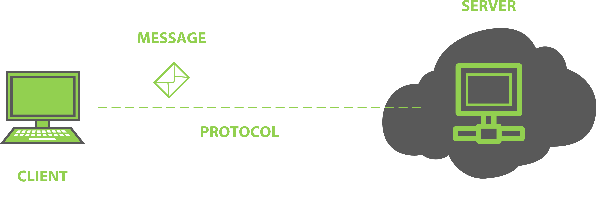

# Conceitos Básicos de Desenvolvimento Web

Quando uma pessoa qualquer acessa internet, ela tem contato com 3 conceitos de desenvolvimento web básicos:

- Navegador ou cliente web
- Servidor
- Endereço ou URL

Esses conceitos vem cada vez mais se tornando comuns na sociedade em que vivemos, e talvez se você perguntar pro seu irmão menor "O que é um servidor?", muito provavelmente ele dará uma resposta muito proxíma da correta.  

Uma coisa que temos que entender, é que em termos básicos, a comunicação na web é uma conversa entre 2 dispositivos, um dispositivo que recebe o nome de cliente e outra que recebe o nome de servidor. 

O dispositivo cliente, executa um software que faz solicitações e exibe respostas. 

O dispositivo servidor executa um software que recebe requisições, faz algum processamento ou busca de informações e envia uma resposta para o dispositivo que realizou a solicitação.

Para que a comunicação entre cliente e servidor ocorra com sucesso, ambos tem que seguir alguma regras de comunicação. Chamamos essas regras de comunicação de **protocolo**. No caso da comunicação web, o protocolo usado é o HTTP. 

## HTTP e Servidores Web

HTTP é um protocolo(padrão) para transferência de hipertexto. Nesse protocolo temos os conceitos de *request* (requisição) e *response*(resposta). O protocolo HTTP funciona tirando proveito de 2 outros protocolos, TCP e IP. 

O protocolo TCP é responsável por garantir que um arquivo enviado de um dispositivo para outro chegue íntegro ao seu destino, ainda que o arquivo esteja dividido em blocos no momento do envio. 

O IP é o protocolo de sustentação que transfere/roteia os blocos(pacotes) de um dispositivo para o outro no seu caminho até o destino. 

Em resumo, o HTTP é um protocolo de rede que tem características específicas para web, mas ele depende do TCP/IP para obter a solicitação e a resposta completas de um lugar para o outro. A estrutura de uma conversa HTTP é uma sequência simples de solicitação/resposta; *um navegador(browser) solicita e um servidor responde*.

## Outros protocolos importantes

A seguir temos uma breve descrição de outros protocolo que provavelmente você terá contato durante sua vida como desenvolvedor web:

- **HTTPS (Hyper Text Transfer Secure — Protocolo de Transferência de Hipertexto Seguro)** -> funciona exatamente como o HTTP, porém, existe uma camada de proteção a mais. Isso significa que os sites que utilizam esse protocolo são de acesso seguro.

- **FTP** - Protocolo de Transferência de Arquivos, do inglês File Transfer Protocol,  é um protocolo para transferir dados entre dois computadores através de uma rede.

- **SSH** - também conhecido como Secure Shell, é um protocolo que permite a execução segura de comandos em um servidor remoto, através de uma conexão via rede. 

## Páginas Estáticas e Páginas Dinâmicas

Um aplicativo de Web é um conjunto de páginas de Web estáticas e dinâmicas. Uma página da **Web estática** é aquela que não se altera quando um visitante a solicita: o servidor Web envia a página para o navegador da Web solicitante sem modificá-la. Já uma página da **Web dinâmica** é modificada pelo servidor antes de ser enviada para o navegador solicitante. A natureza mutável da página justifica ela ser chamada de dinâmica.

Um bom exemplo de página dinâmica é a timeline do facebook ou do instagram. A cada vez que você acessa essa página, novos dados aparecem na sua tela, embora o endereço que você digite no navegador seja o mesmo. Se o resultado dessa página fosse sempre o mesmo, ela seria considerada uma página estática. 

Nas próximas aulas você fará exercícios que lhe ajudarão a ter maior familiaridade com esses conceitos.

## Tecnologias WEB

Quando estamos falando de tecnologias web, em especial tecnologias que executam no lado do cliente, temos que pensar em 3 objetivos específicos: 

- **Marcação**: trata-se da linguagem de marcação _**HTML**_, responsável por definir o que será exibido como conteúdo em uma página e criar as ligações (links) para outros conteúdos;

- **Apresentação**: está associado à tecnologia _**CSS**_, que é uma linguagem de estilo utilizada para definir a aparência de documentos escritos em HTML. Seu principal benefício é prover a separação entre o formato visual e o conteúdo de um documento;

- **Comportamento**: aqui vamos lidar com a linguagem _**JavaScript**_, utilizada para trazer mais dinamismo às páginas web através de recursos como controle de eventos, manipulação de *elementos DOM* e seus conteúdos, entre outras funcionalidades.

Durante nosso curso, trabalharemos com cada um desses objetivos e com suas respectivas tecnologias. 

## Referências

- https://helpx.adobe.com/br/dreamweaver/using/web-applications.html

- https://www.w3schools.com/whatis/whatis_http.asp

- https://www.w3schools.com/whatis/whatis_html.asp

- https://www.w3schools.com/whatis/whatis_css.asp