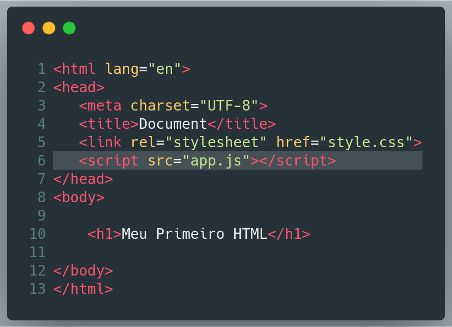
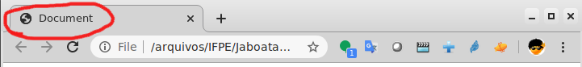

# Aula 1

## Tópicos abordados

- Aspectos básicos do uso de HTML5
- Criação de um documento HTML
- Estrutura básica de um documento HTML


### HTML5

A melhor forma de aprender a programar é programando. Então vamos direto ao ponto. O exemplo a seguir apresenta um documento HTML simples. A ideia nessa aula é entender a estrutura desse arquivo pra gente poder fazer páginas maiores e melhores. 



Vamos às considerações importantes sobre o documento anterior. 

#### TAGS

Pra entender código HTML você precisa primeiro entender o conceito de **TAG**. Pense numa página web como uma conversa com o navegador. 

Toda página HTML começa com a tag **\<html\> ...  \</html\>**. Isso define o início e o fim de uma página web. Pense numa tag como uma instrução que você dá para o navegador. No caso do documento anterior, você está dizendo na linha 1 *"Navegador, minha página web começa aqui. Pode começar a traduzir meu código."* e na linha 13 você está dizendo *"Navegador, minha página terminou. Pode descansar agora".*  

#### Cabeçalho

Durante nossa conversa com o navegador web, precisamos as vezes definir as regras do jogo antes dele começar a mostrar coisas na tela. Essas regras do jogo são definidas no cabeçalho. 

O cabeçalho de uma página web é definido pela tag **\<head\> ...  \</head\>**. O que isso diz é  ... *"Navegador, vou te dizer algumas coisas antes de você começar a mostrar coisas na tela do usuário"*.

A primeira informação dita é: 

```html
   <meta charset="UTF-8">
```

Isso diz ao navegador que o padrão de caracteres utilizados pra essa página é UTF-8. Não sabe o que isso significa ? Não se preocupe agora. Teremos tempo pra entender isso. Por enquanto é suficiente você saber que isso vai evitar que você tenha problemas na interpretação de caracteres especiais. 

A segunda informação é:

```html
   <title>Document</title>
```

Isso diz para o navegador qual o título da página. Esse texto aparece na barra superior do navegador ou no nome da aba onde a página foi aberta. 



A terceira informação é:

```html
   <link rel="stylesheet" href="style.css">
```

Com esse comando você vai dizer ao navegador algo do tipo *"O Kit de maquiagem que você vai usar nessa página é  style.css"*. [Brincadeira]  
Cada vez mais a beleza e facilidade de uso das páginas web ganha importância. Isso é tão verdade que existe uma linguagem específica para estilizar nossas páginas web. Essa linguagem se chama **CSS**.  

Essa linguagem fornece formas de dizermos ao navegador como queremos que nossa página web seja exibida. Mais a frente iremos entrar em mais detalhes sobre essa linguagem. Por enquanto, é suficiente você saber que eu posso especificar arquivos __*.css*__ que serão utilizados para estilizar minha página web. 


A quarta coisa que estamos dizendo pro navegador é: 

```html
   <script src="app.js"></script>
```

Nesse comando estamos dizendo ao navegador *"Utilize o arquivo __app.js__. Nele você encontrará informações sobre como minha página deve se comportar quando o usuário interagir com ela."*  

O arquivo __app.js__ contém comandos numa linguagem chamada JavaScript. Provavelmente você já ouvir falar dela. Nesse curso iremos entender como essa linguagem interage com um documento HTML.

Agora é suficiente você saber que nesse arquivo estarão informações sobre como o navegador deve se comportar quando o usuário passar o mouse em alguma imagem na tela, ou quando o usuário clicar em alguma coisa, ou fizer alguma interação com minha página web. 

